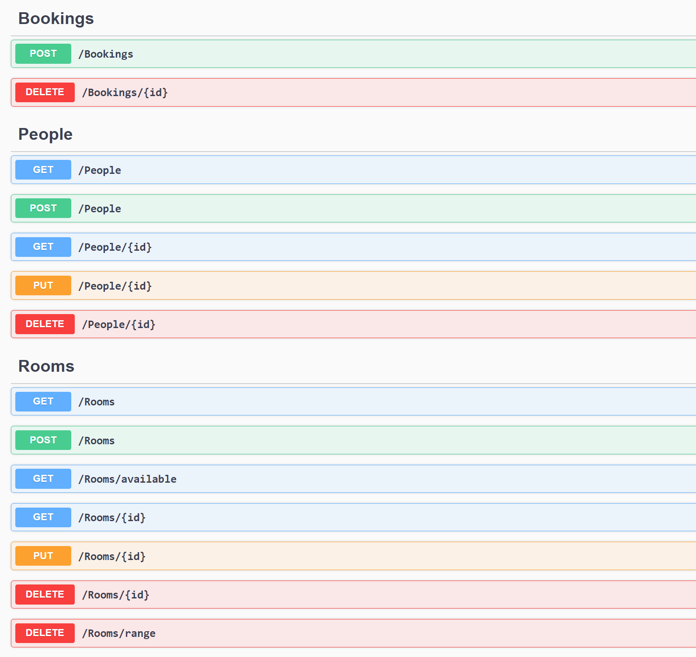
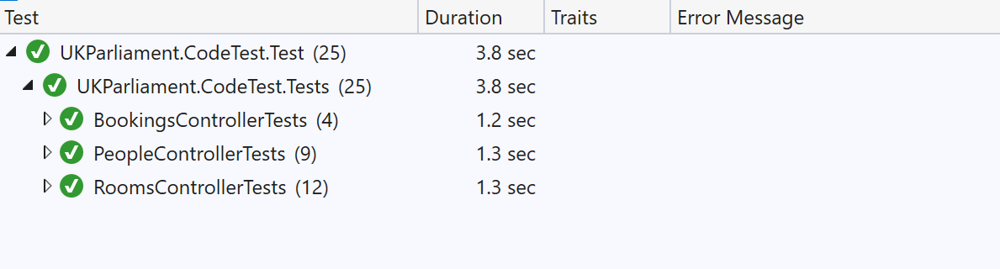

# API for fictional room booking system 

## Introduction

This solution implements an API for a fictional room booking system. Following actions are implemented under 3 controllers

### People Controller
* Controller manages Person entity.Following actions are ddefined in this controller
    * Get /People  -  Retuns details of  Person based on search critriea       
    * Post /People -  Create person record in database from request body. Name of person is required  
    * Get /People/{id} - Returns Person details for the given id
    * Put /People/{id} - Update the person record from request body for the given id.
    * Delete /People/{id} - Delete person with given id. All bookings related to the person will also be deleted
### Rooms Controller
* Controller to manage Rooms entity. Following actions are defined in this controller
    * Get /Rooms - Returns rooms which matches given search critriea
    * Post /Rooms - Create Room record in database from request body. Name od Room is required    
    * Get /Rooms/available Returns rooms which are available between given start and end date
    * Get /Rooms/{id}  Returns room with given id
    * Put /Rooms/{id}  Update the room record from request body for the given id.
    * Delete /Rooms/{id}  Deletes the room with given id. All bookings related to the rool will also be deleted.If alternate room is provided in request then bookings will be moved to that room.
    
### Bookings
* Contoller to manage Booking entity. Following actions are defined in this controller.
  * Post /Bookings  - Creates Booking in database from request body.
  * Delete /Bookings/{id} - Delete booking with given id.

## .NET Core API Best Practices

Following are some best practices implemented while developing this solution.

* SOLID design principle - The solution is designed and implemented adhering to SOLID design principle
* Project Organization - The solution is split into projects and all artifacts in projects are grouped into folders
* Repository Pattern for Data Access -   Repository pattern is used as an abstraction layer between the data access and the business logic layer of an application. By using it, we are promoting a more loosely coupled approach to access our data from the database. 
* Controllers and Actions - Controllers and Action are kept clean. It does not have business logic and is used only for accepting the service instances through the constructor injection and for organizing HTTP action methods
* Exception Handling - All exception are handled by `try-catch` block. Also .NET Core gives us an opportunity to implement exception handling globally with use middleware.
* Logging -  Log messages are very helpful when figuring out how our software behaves in production.Logging is currently send console, but can be extented.
* Action Filters - Used action filters to remove duplicated code. For e.g a custom action filter is added to do model validation.
* Routing - Attribute based routing is implemented instead of conventional routing 
* Asynchronous Code - used async programming (using `async-await`) to enhance the responsiveness of  application.
* Unit test - Unit test are added to validate all actions.

